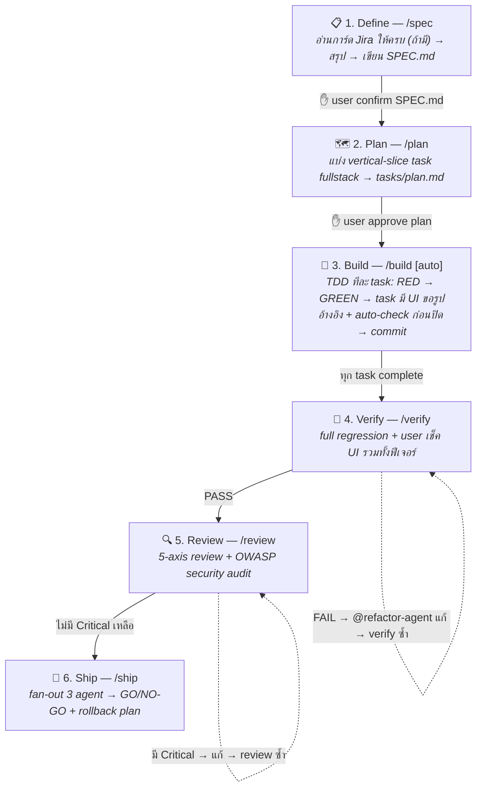

# 🧭 7knight

> **Personal dev-workflow kit** สำหรับ Claude Code — ติดตั้งครั้งเดียว ได้ทีม AI agent ครบวงจรตั้งแต่เก็บ requirement จนถึงตัดสินใจ ship โดยไม่มีไฟล์ถูก copy เข้าโปรเจกต์ของคุณ

**7 Agents · 10 Commands · 16 Skills · 1 Always-on Hook**

🌐 **เวอร์ชัน web สวยๆ อ่านง่าย:** [7knight overview](https://claude.ai/code/artifact/486e539b-2c2c-4e35-a5dd-1dd77aafc615)

---

## ⚡ ติดตั้ง

```
/plugin marketplace add thitiwut00897/7knight
/plugin install 7knight
```

อัปเดตด้วย `/plugin update 7knight` — ตัว plugin อยู่ใน global cache ของ Claude Code ไม่แตะ repo ของคุณเลย มีเพียง `/init-project-docs` และ `/po-workflow` เท่านั้นที่เขียนไฟล์เข้าโปรเจกต์ และเฉพาะตอนที่คุณสั่งเอง

### เริ่มใช้ในโปรเจกต์ใหม่ (ทางเลือก — รันครั้งเดียวต่อโปรเจกต์)

```
/init-project-docs
```

สร้าง `docs/codebase-docs/project-blueprint.md` + `AI-GUIDE.md` และผูก reference เข้า `CLAUDE.md` ให้อัตโนมัติ — ไฟล์นี้คือ "สมอง" ที่ทุก agent ใช้อ่าน stack, คำสั่ง lint/test, และ convention ของโปรเจกต์ (แทนการเดา)

---

## 🔄 Workflow 6 Stage ทำงานยังไง

สั่ง `/po-workflow` คำสั่งเดียว — `@po-agent` จะ orchestrate ทั้ง 6 stage ให้ **ห้ามข้าม gate** และหยุดรอคุณ confirm ในจุดสำคัญเสมอ:



### จุดสำคัญที่ควรรู้

- 🎫 **ไม่มีการ์ด Jira ก็ใช้ได้เต็มรูปแบบ** — Jira เป็น optional ทุกจุด: `/spec` จะถามว่ามีการ์ดไหม ถ้าไม่มีก็ใช้คำอธิบายของคุณตรงๆ, `/plan` ข้ามการสร้าง subtask, branch ตั้งชื่อ `feature/{short-name}` แทน `feature/{JIRA-KEY}/{short-name}`
- 🖼️ **Task มี UI ต้องมีรูปอ้างอิงก่อนเริ่ม** — ถ้า task ไหนมีส่วน frontend `/build` จะขอรูป mockup/design จากคุณก่อนเริ่ม (ห้ามเดา layout/icon เอง ต้องขอ asset จริงถ้าไม่มี) แล้วปิด task ด้วย auto-check เทียบผลลัพธ์จริงกับรูปนั้นด้วย `webapp-testing` บนโปรเจกต์ web (โปรเจกต์ mobile ให้ user เช็คเองแทน — ดู `/regression-sim-use` สำหรับ regression test ผ่าน simulator/emulator แยกต่างหาก) — ไม่ตรงวนแก้เองสูงสุด 3 รอบ ก่อนส่งให้คุณ confirm รอบสุดท้ายเสมอ
- 🎚️ **Opt-in เท่านั้น** — lifecycle เริ่มเมื่อคุณสั่ง `/po-workflow` เอง ไม่รันอัตโนมัติ งานเล็กๆ คุยตรงๆ หรือ mention agent ที่ต้องการได้เลย
- 🧩 **รันแยกทีละ stage ก็ได้** — เรียก `/spec` `/plan` `/build` `/verify` `/review` `/ship` เองตามจังหวะที่ต้องการ ไม่ต้องผ่าน po-agent

---

## 💡 ตัวอย่างการใช้งาน

### 1) ฟีเจอร์เต็มรูปแบบ — ไม่มีการ์ด Jira

```
/po-workflow เพิ่มหน้าประวัติการสั่งซื้อ พร้อม filter ตามช่วงเวลา และ export CSV
```

`/spec` จะถามว่ามีการ์ด Jira ไหม → ตอบ "ไม่มี" → ใช้คำอธิบายข้างบนเป็น requirement ตรงๆ → สรุปให้คุณ confirm → ได้ `SPEC.md` → `/plan` แบ่ง task ให้ approve → ไล่ Build → Verify → Review → Ship จนจบ

### 2) รันทีละ stage เอง — ควบคุมเต็มที่

```
/spec เพิ่มปุ่ม export CSV ในหน้ารายงานยอดขาย
/plan
/build          # ทำ task ถัดไป 1 ตัวแล้วหยุดรอ
/build auto     # หรือรันทุก task รวดเดียว (ขอ approve ครั้งเดียว)
/verify
/review
/ship
```

โหมด `auto` จะหยุดถามเองเมื่อเจอ task ที่ high-risk (auth, payment, migration), AC คลุมเครือ, หรือแก้ test fail ไม่ได้ — แก้ปัญหาแล้วสั่ง `/build auto` ซ้ำ จะ resume จาก task ที่ค้าง

### 3) งานเล็ก — เรียก agent ตรงๆ ไม่ต้องเข้า lifecycle

```
@code-reviewer ช่วยรีวิว diff ล่าสุดให้หน่อย
@security-auditor เช็ค endpoint ใหม่ที่เพิ่งเพิ่มว่ามีช่องโหว่ auth ไหม
@refactor-agent แก้ lint error ทั้งหมดโดยไม่เปลี่ยน behavior
```

---

## 🤖 Agents (7 ตัว)

แต่ละตัวมีขอบเขตชัดเจน รับคำสั่งเฉพาะจาก stage ที่กำหนด — ไม่ทำงานข้ามหน้าที่กัน

| Agent | เรียกผ่าน | หน้าที่ |
|---|---|---|
| 🧭 `po-agent` | `/po-workflow` หรือ `@po-agent` | Orchestrator ทั้ง 6 stage — คุมลำดับ บังคับ gate หยุดรอ confirm ห้ามเดาว่า user โอเคแล้วเดินหน้าเอง |
| 🔴 `tester-agent` | `/build`, `/verify` | เขียน test ที่ต้อง FAIL ก่อน implement (RED) จาก AC ของ task และรัน full regression ตอน Verify — ห้ามแตะ production code |
| 🟢 `senior-full-stack-agent` | `/build`, `/review` | Implement backend ก่อนแล้วต่อ frontend ตามรูปอ้างอิงที่ user ส่งเป๊ะๆ (ห้ามเดา icon) ให้ test ผ่าน (GREEN) — ไม่ผูก stack อ่านจริงจาก `project-blueprint.md` |
| 🔧 `refactor-agent` | `/verify`, `/review` | แก้ lint/test failure และ Critical finding โดย**ไม่เปลี่ยน behavior** — ห้ามลบ test ห้ามแก้ expectation ให้ตรง code ที่ผิด |
| 🔍 `code-reviewer` | `/review`, `/ship` | รีวิว 5 มุมมอง: correctness, readability, architecture, security, performance — ทุก finding มี file:line + วิธีแก้ |
| 🛡️ `security-auditor` | `/review`, `/ship` | Audit แนวลึกแบบ OWASP Top 10 — injection, auth/authz, secrets, dependency CVE — Critical/High บล็อก ship ทันที |
| 📊 `test-engineer` | `/ship` เท่านั้น | วิเคราะห์ coverage gap ทั้งฟีเจอร์ (happy path, edge case, error path, concurrency) — ชี้ gap ไม่เขียน test เอง |

## ⌨️ Commands (10 คำสั่ง)

| คำสั่ง | ทำอะไร | ผลลัพธ์ |
|---|---|---|
| `/po-workflow [งาน/การ์ด]` | เริ่ม lifecycle เต็ม 6 stage ผ่าน @po-agent | ฟีเจอร์เสร็จพร้อม ship |
| `/spec [งาน/การ์ด]` | เก็บ requirement + confirm ความเข้าใจ | `SPEC.md` |
| `/plan` | แบ่งเป็น vertical-slice task (read-only ห้ามแก้ไฟล์) | `tasks/plan.md` + `tasks/todo.md` |
| `/build [auto]` | implement แบบ TDD ทีละ task บน feature branch จาก develop — task ที่มี UI ขอรูปอ้างอิงจาก user ก่อนเริ่ม แล้วปิด task ด้วย auto-check เทียบผลลัพธ์กับรูปนั้น (webapp-testing บน web ที่ตั้งค่าไว้ / mobile ให้ user เช็คเอง — วนแก้เองสูงสุด 3 รอบก่อนส่งให้ user confirm) | commit แยกต่อ task |
| `/verify` | full regression (lint + test + build เต็มชุด) + เช็ค UI ทั้งฟีเจอร์ด้วย user เช็คเอง | PASS / FAIL report |
| `/review` | 5-axis review + security audit บน diff ทั้ง branch | รายงาน Critical / Important / Suggestion |
| `/ship` | fan-out 3 agent พร้อมกัน → รวมผล 6 หมวด | **GO/NO-GO** + rollback plan บังคับ |
| `/init-project-docs` | สร้าง `project-blueprint.md` + `AI-GUIDE.md` (idempotent รันซ้ำได้) | เอกสาร baseline ของโปรเจกต์ |
| `/debug [งาน/การ์ด]` | 4-stage workflow เข้มสำหรับแก้บั๊ก: `/spec` → `/build` → `/verify` → `/review` — คนละแบบกับ Bug Fast Path ใน `/spec` | บั๊กถูกแก้ + verify จริง |
| `/regression-sim-use [record <feature>/<page> \| <feature>/<page> \| ว่าง]` | Regression test มือถือด้วย sim-use แยกจาก workflow หลัก — replay flow script ใน `tester_flow/` ทั้งหมดหรือเฉพาะหน้า (ผ่านไม่ crash + เก็บ screenshot ให้ user ตรวจเอง) หรือ record flow ใหม่/อัปเดตของเดิม | `tester_flow/{feature}/{page}/flow.sh` + screenshot ให้ตรวจ |

## 🧩 Skills (11 ตัว)

Claude เรียกใช้เองอัตโนมัติเมื่อเข้าเงื่อนไข หรืออ้างชื่อตรงๆ ได้ เช่น *"ใช้ skill clean-code แยกไฟล์นี้หน่อย"*

| Skill | ใช้เมื่อ |
|---|---|
| `clean-code` | สร้าง/แก้ Container, Component, Hook หรือไฟล์เกิน ~300 บรรทัด (React Native) |
| `codeing-guide` | ตั้งชื่อตัวแปร/ฟังก์ชัน, จัดการ state ด้วย Redux/hooks |
| `ui-guide-template` | งาน layout/Flexbox ใน React Native ที่ซับซ้อน |
| `scroll-bottom-safe-area` | ScrollView ที่เนื้อหาท้ายจอโดน navigation bar / home indicator บัง |
| `api-design` | ออกแบบ/รีวิว REST API — naming, status code, pagination, versioning |
| `baseline-ui` | งาน Tailwind — animation duration, typography scale, layout anti-pattern |
| `fixing-motion-performance` | animation กระตุก — layout thrashing, compositor properties |
| `find-skills` | ค้นหา/แนะนำ skill อื่นจาก skills.sh เมื่อ user ถามหาความสามารถที่อาจมี skill สำเร็จรูปอยู่แล้ว |
| `starter-kit-upgrade` | ดึงฟีเจอร์ใหม่จาก Laravel starter kit (vue/react/svelte/livewire) เข้าโปรเจกต์ที่ bootstrap มาจากมัน ทีละฟีเจอร์บน branch แยก |
| `webapp-testing` | ทดสอบ/debug เว็บแอปด้วย Playwright (screenshot, console log, form/UI flow) — ใช้เป็น auto UI check เทียบรูปอ้างอิงต่อ task ตอน `/build` บนโปรเจกต์ web ด้วย |
| `sim-use` | ขับ iOS Simulator / Android emulator ผ่าน accessibility tree — tap/swipe/type, อ่าน UI, screenshot (vendored จาก [lycorp-jp/sim-use](https://github.com/lycorp-jp/sim-use)) — ใช้โดย `@tester-agent` ใน `/regression-sim-use` เท่านั้น |

## 🛡️ Always-on Rules (ไม่ต้องเรียก — ทำงานเองทุก session)

`SessionStart` hook ฉีดกฎ 3 ข้อเข้าทุก session อัตโนมัติ:

1. **Simple Code** — KISS, diff แคบ, ห้าม over-engineer (ไม่มี abstraction/factory สำหรับโค้ดใช้ครั้งเดียว, ไม่ refactor ไฟล์ที่ไม่เกี่ยว)
2. **No Bulk Delete of Working Files** — ห้ามลบไฟล์ที่กำลังแก้อยู่เป็นชุดๆ โดยไม่มีรายการชัดเจนจาก user
3. **Jira/Issue Card Read Gate** — ถ้ามีลิงก์การ์ด/issue แต่อ่านไม่ได้จริง ให้หยุดถามก่อน ห้ามเดา requirement ต่อ

ข้อความเต็ม: [`hooks/always-on-rules.md`](hooks/always-on-rules.md)

---

## 🛠️ สำหรับพัฒนา plugin นี้เอง (local)

ทดสอบการแก้ไขกับ checkout ในเครื่องก่อน publish:

```
/plugin marketplace add /path/to/7knight
/plugin install 7knight
```

## 🚫 นอกขอบเขต

- กฎ/สกิลเกี่ยวกับ SonarQube และ `work-summary-output-format` ถูกตัดออกตอน migrate จาก Cursor → Claude Code
- การรองรับ Cursor (`.cursor/`, `.mdc` rules, `setup-cursor.sh`) ถูก retire จาก repo นี้แล้ว

รายละเอียดการ migrate: [`docs/superpowers/specs/2026-07-05-claude-code-plugin-migration-design.md`](docs/superpowers/specs/2026-07-05-claude-code-plugin-migration-design.md)
